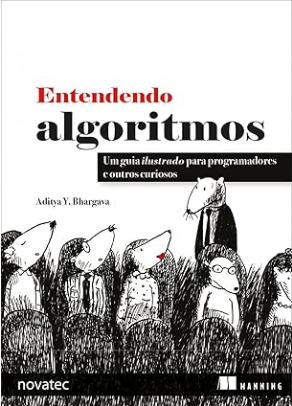

# Livro Entendendo Algoritmos
O livro Entendendo Algoritmos é um guia ilustrado e acessível para programadores e curiosos que desejam aprender e aplicar algoritmos essenciais da ciência da computação. Ele ensina, de forma prática e visual, a resolver problemas comuns de programação, desde ordenação e pesquisa até desafios mais complexos, como compressão de dados e inteligência artificial. Inclui diagramas detalhados, códigos em Python e comparações de desempenho entre algoritmos, ajudando o leitor a entender e utilizar esses conceitos no dia a dia.

